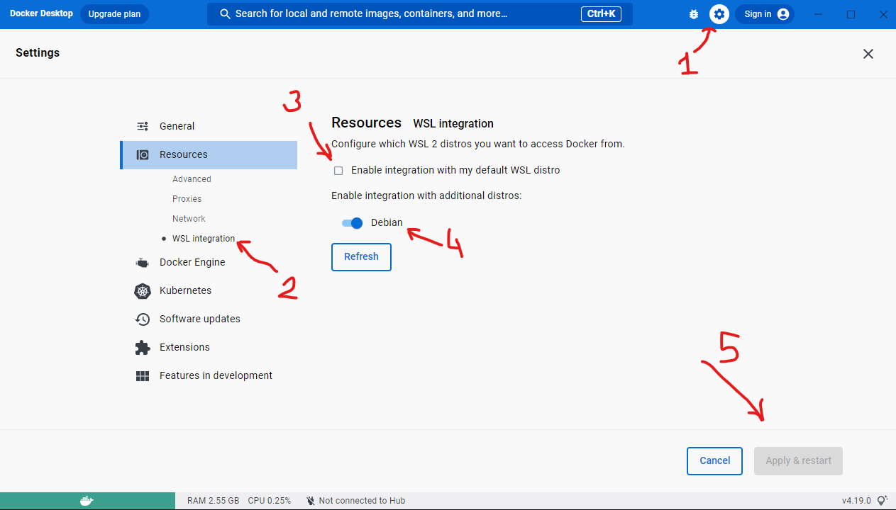
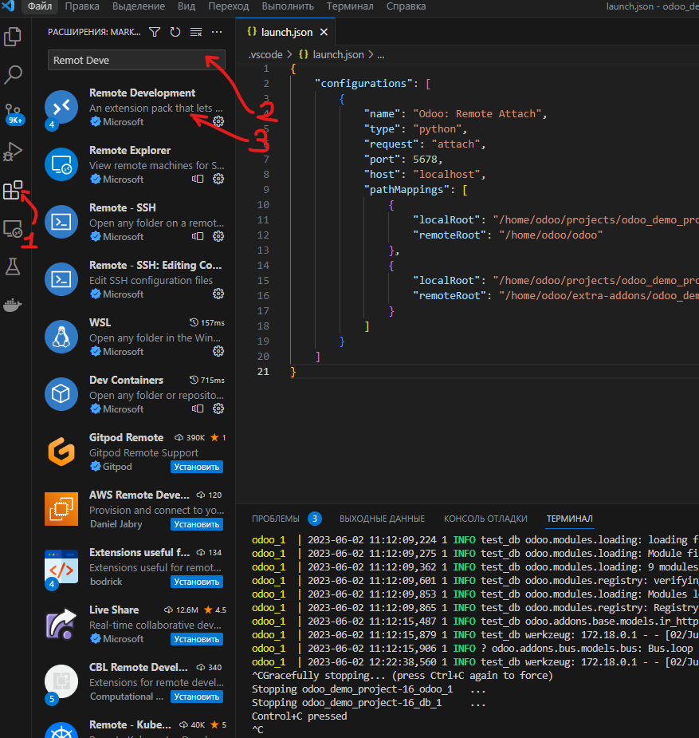
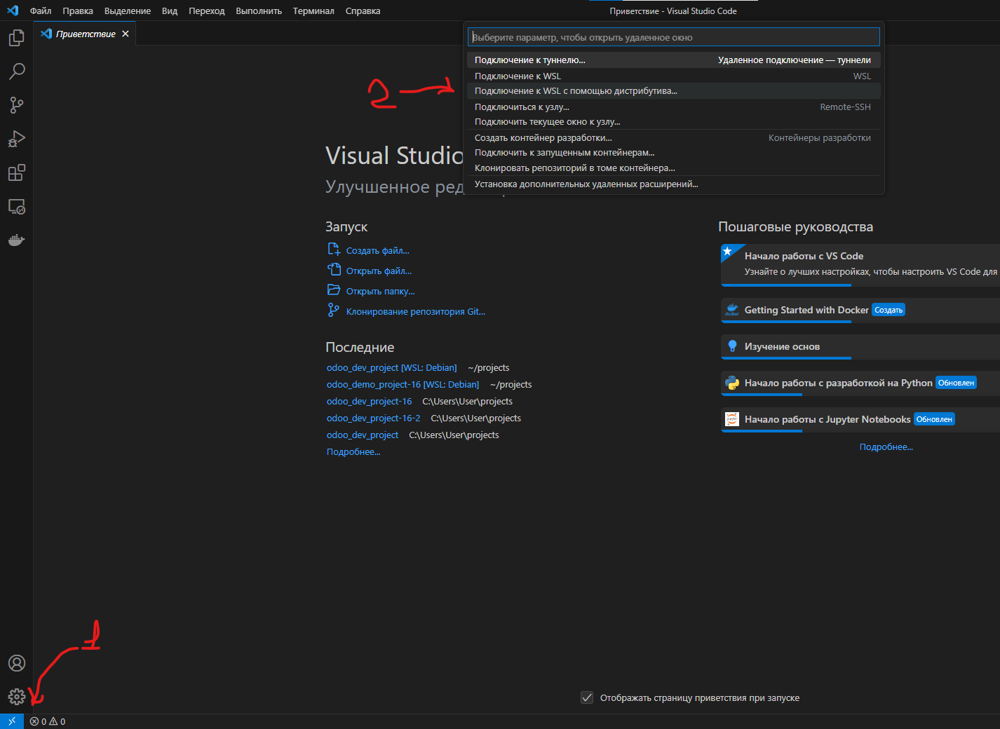
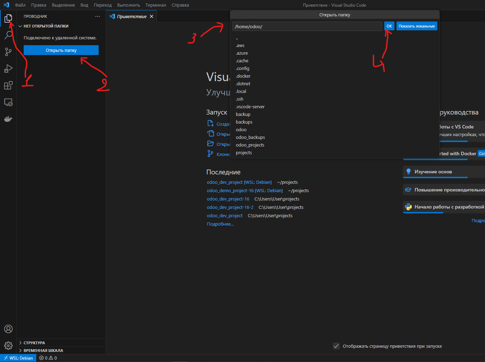
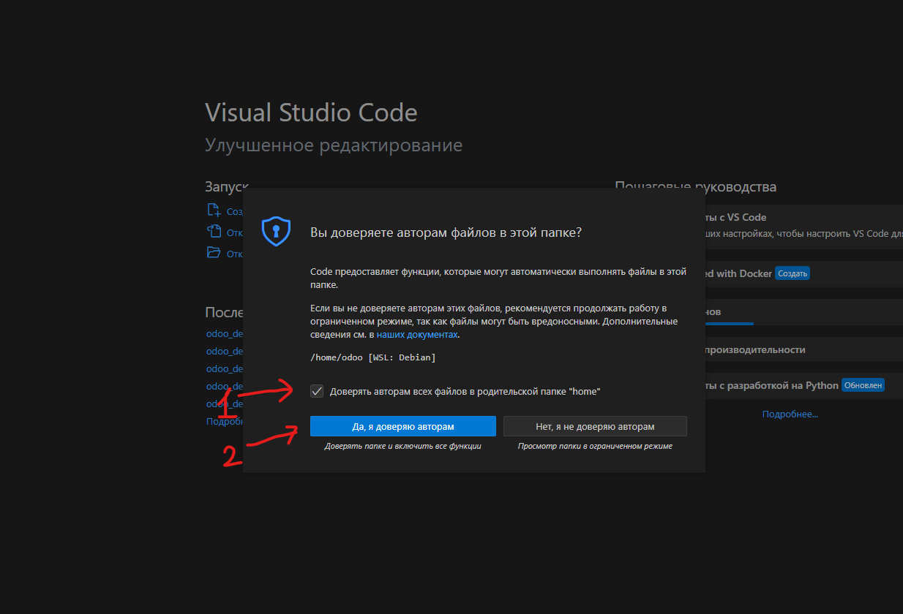
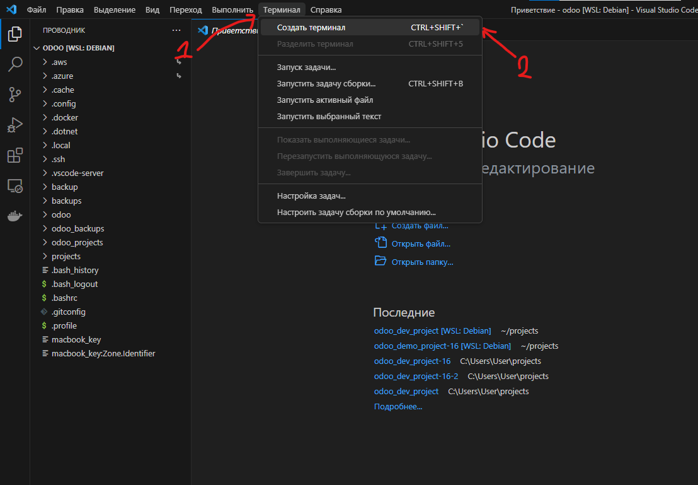

# Windows (WSL) — подробная иснтсрукция

На Windows odpm работает через **WSL2** и **Docker Desktop**. Проект и `odpm --init` выполняйте в файловой системе Linux (`/home/...`), не на `C:\` через `/mnt/c` — иначе bind mount в Docker будет медленным.

## Зачем использовать WSL, а не «просто Windows»

При работе с каталогами на диске Windows (`/mnt/c/...`) файлы для WSL выглядят как сетевые, и проброс в контейнер работает **очень медленно**. Рабочий каталог odpm лучше держать **внутри WSL** (`/home/<user>/projects/...`).

**Ограничения:** копирование между Windows и WSL медленное; диск WSL растёт динамически. Для небольших и учебных проектов это нормально; для тяжёлой промышленной разработки надёжнее **нативный Linux**. Ну либо вы точно знаете что делаете.

## Что должно быть установлено заранее

- [Docker Desktop for Windows](https://www.docker.com/products/docker-desktop/)
- [Visual Studio Code](https://code.visualstudio.com/)

При установке Docker Desktop обычно подтягивается **WSL2** и служебные дистрибутивы `docker-desktop` / `docker-desktop-data`.

Далее ставим **отдельный** Linux-дистрибутив для работы — в оригинальной статье используется **Debian** (ниже по шагам). Ubuntu тоже подойдёт; команды `apt` те же.

---

## 1. Включение WSL (PowerShell от администратора)

```powershell
Enable-WindowsOptionalFeature -Online -FeatureName Microsoft-Windows-Subsystem-Linux
```

Проверка версии WSL и смена на WSL2 — см. [документацию Microsoft](https://learn.microsoft.com/ru-ru/windows/wsl/install).  
Удаление лишнего дистрибутива — при необходимости через `wsl --unregister`.

---

## 2. Установка Debian в WSL

```powershell
wsl --install -d Debian
```

Debian не принципиален, вы можете использовать и Ubuntu или другой дистрибутив, просто все ниже оговоренные шаги протестированы именно на Debian и могут иметь место отличия, поэтому учитывайте этот момент.
При первом запуске задайте пользователя и пароль. В примере ниже — пользователь `odoo` (можете выбрать своё имя):

```
odoo@DESKTOP-XXXXXX:~$
```

Повторный вход:

```powershell
wsl --distribution Debian --user odoo
```

---

## 3. Настройка Docker Desktop

Запустите Docker Desktop.



1. Откройте **Settings** (шестерёнка).
2. Раздел **Resources → WSL integration** (в старых версиях — **WSL Integration**).
3. **Отключите** встроенный дистрибутив `docker-desktop`, если он мешает (как в оригинальной статье).
4. **Включите** интеграцию для **Debian**.
5. **Apply & restart**.


---

## 4. VS Code: расширение Remote Development



1. Откройте панель расширений.
2. Найдите **Remote Development** (или **WSL**).
3. Установите.

---

## 5. Подключение к Debian (WSL)



1. Кнопка **Remote** в левом нижнем углу (или Command Palette).
2. **WSL: Connect to WSL** → выберите **Debian**.

Первое подключение может занять несколько минут (установка server-компонента в WSL).

---

## 6. Рабочий каталог в WSL



1. **File → Open Folder**.
2. Выберите домашний каталог, например `/home/odoo`.



3. На вопрос о доверии авторам — отметьте «доверять» и подтвердите.

Откройте встроенный терминал: **Terminal → New Terminal**.



Терминал должен быть **внутри Debian** (в статус-баре: `WSL: Debian`).

---

## 7. Пакеты в Debian и установка odpm

Минимальный набор:

```bash
sudo apt update
sudo apt install -y git
```

Установите odpm одним из способов:

**Вариант A — .deb (рекомендуется):** см. [Установка Debian / Ubuntu](linux-deb.md) — скачать `.deb` с [GitHub Releases](https://github.com/aayartsev/odpm/releases) или подключить APT-репозиторий.

```bash
sudo apt install ./odpm_*.deb
odpm --version
```

**Вариант B — pip / pipx:** см. [pip и исходники](pip-legacy.md).

Опционально для навигации по файлам:

```bash
sudo apt install -y mc
```

Домашний каталог пользователя: `/home/odoo` (или ваше имя). Корень ФС Linux — `/`.

---

## 8. Каталог проектов и первый `odpm --init`

```bash
mkdir -p ~/projects
cd ~/projects
mkdir odoo_demo_project-19
cd odoo_demo_project-19
```

Инициализация с публичным demo-репозиторием (Odoo 19.0):

```bash
odpm --init https://github.com/aayartsev/odoo_demo_project.git --branch 19.0
```

> Подробный сценарий и другие major — [Локальная разработка с нуля](../getting-started/local-dev-from-scratch.md), [demo-проекты](../contributing/demo-projects.md).

Мастер спросит про каталоги и сценарий; на незнакомые пункты можно жать **Enter** (значения по умолчанию).

После подготовки:

```bash
odpm -d test_db -i -u
```

Браузер: `http://127.0.0.1:8069`.

Откройте каталог проекта в VS Code через **Open Folder** → `/home/odoo/projects/odoo_demo_project-19` (уже в сессии WSL).

---

## 9. Git и SSH

Для приватных репозиториев настройте SSH-ключ **внутри WSL** (инструкции для Linux, не Windows). См. также [Ссылки на репозитории](../reference/git-links.md).

---

## 10. Перезапуск odpm

Остановка: `Ctrl+C` в терминале, где запущен odpm / compose. Повторный запуск — снова `odpm` или команды из [справочника CLI](../reference/cli.md).

---

## Ссылки `file://` в WSL

```text
file:///home/odoo/my_addons
```

Три слэша после `file:` — см. [git-links](../reference/git-links.md).

---

## Полная таблица установки

[Установка odpm (все платформы)](README.md).
