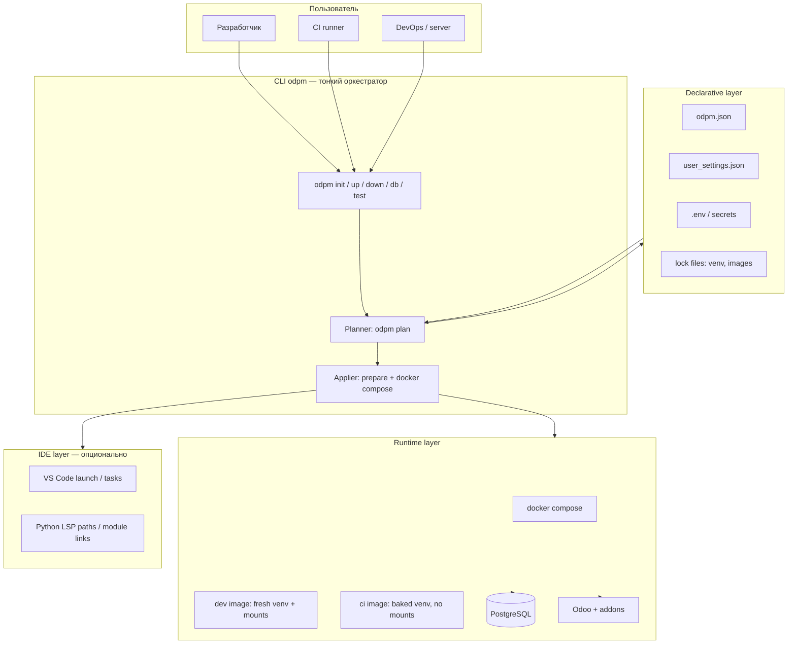
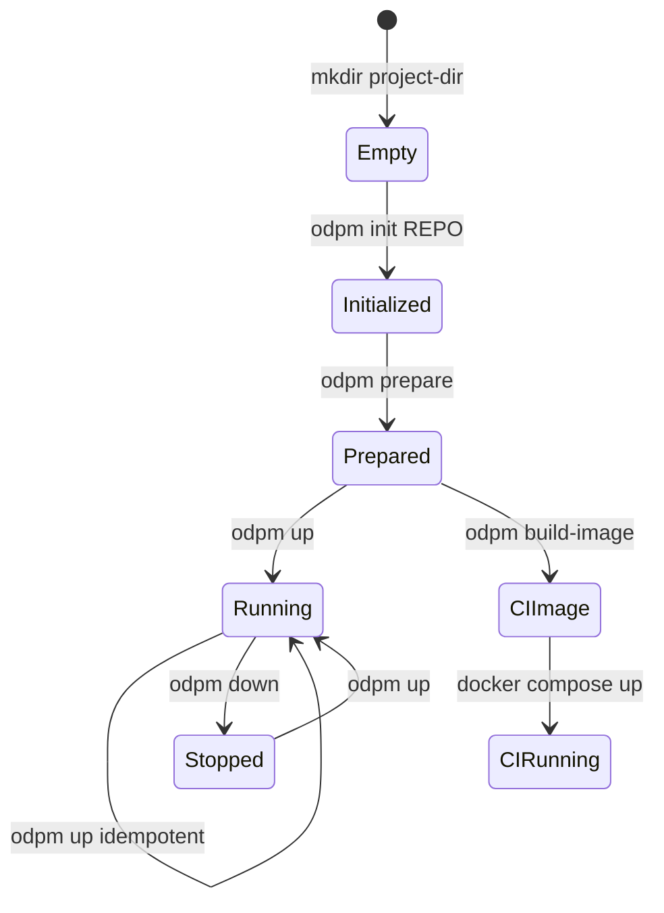
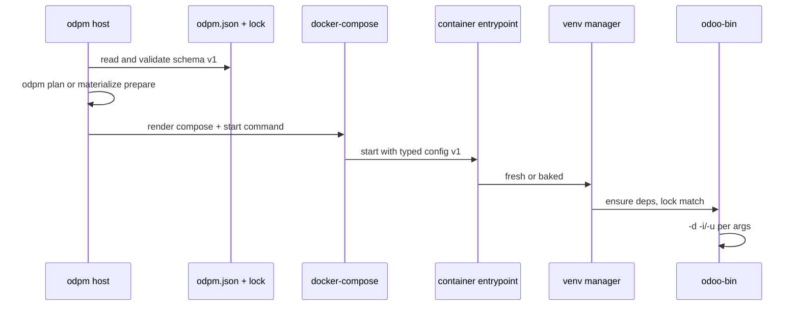
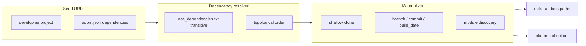
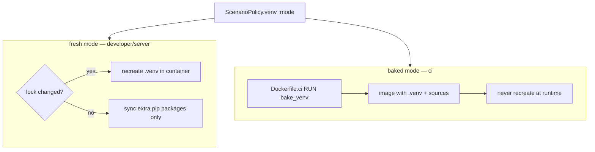
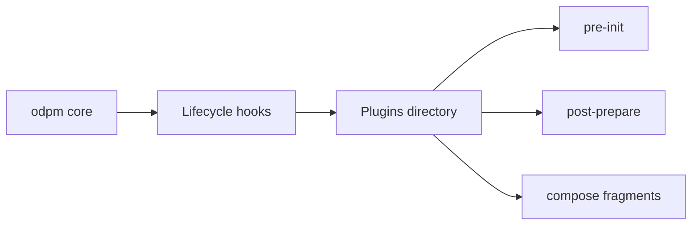
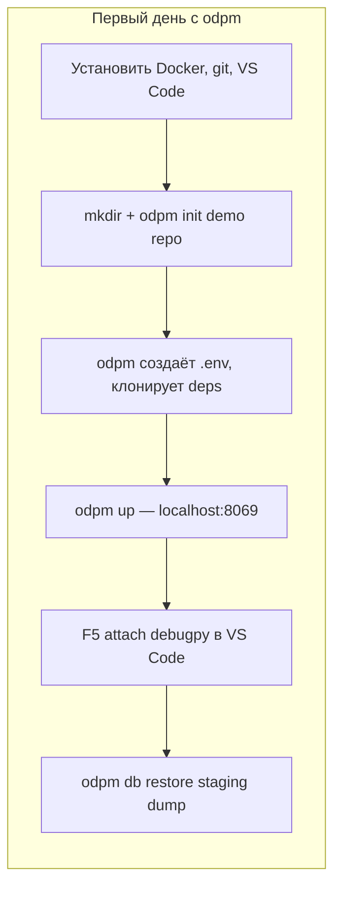

# Идеальная картина odpm: к чему ведут зрелые аналоги

Вы правы: такие инструменты уже есть. odpm решает задачу **«reproducible Odoo dev environment from repo metadata»** — это не уникальная ниша, а хорошо изученный класс продуктов. Ниже — как это выглядит на **хорошем уровне**, с опорой на реальные референсы и на то, куда проект уже движется.

---

## North Star: одна фраза

> **Клонировал репозиторий → одна команда → работающий Odoo с нужными аддонами, БД и отладчиком — на любой машине и в CI.**

`odpm.json` — **declarative manifest** окружения (как `package.json` для Node или `pyproject.toml` для Python, но для Odoo-стека).

---

## Референсы: кто уже «так делает»


| Инструмент                                                    | Уровень             | Что делает хорошо                                                                                            | Чем отличается от odpm                                                                |
| ------------------------------------------------------------- | ------------------- | ------------------------------------------------------------------------------------------------------------ | ------------------------------------------------------------------------------------- |
| **[Doodba](https://github.com/Tecnativa/doodba)** (Tecnativa) | Зрелый OSS          | Multi-stage Docker, aggregating repos, prod-like CI, onbuild hooks, `devel.yaml` / `test.yaml` / `prod.yaml` | Меньше «одной кнопки для новичка», больше DevOps-культуры; другая модель конфигурации |
| **Official Odoo Docker**                                      | Минимальный         | Простой `docker run odoo:16`                                                                                 | Нет multi-repo, нет developing project, нет venv/debug                                |
| **[Dev Containers](https://containers.dev/)** (VS Code)       | Стандарт IDE        | `.devcontainer/` → reproducible workspace в Docker                                                           | Универсальный, не Odoo-specific (нет odpm.json, git deps, nightly platform)           |
| **Odoo.sh**                                                   | SaaS PaaS           | Git push → build → staging/prod, branches, backups                                                           | Закрытый, облачный; эталон UX для Odoo-команд                                         |
| **Gitpod / Codespaces**                                       | Cloud IDE           | URL → dev environment за минуты                                                                              | Облако, не self-hosted Docker на ноутбуке                                             |
| **Nix / devenv**                                              | Reproducibility max | Byte-identical deps                                                                                          | Крутая модель, но высокий порог входа                                                 |


**Вывод:** odpm ближе всего к **Doodba + Dev Container + Odoo.sh-lite для локалки**. Идеал — взять лучшее из каждого слоя, не копируя монолит.

---

## Идеальная архитектура: слои




**Принцип:** CLI не «делает всё сам», а **читает manifest → при `odpm plan` показывает шаги → иначе материализует prepare и поднимает stack**. Как Terraform для dev-окружения, только локально и быстро.

---

## Идеальный lifecycle: три persona, один engine




### Developer (`ODPM_SCENARIO=developer`)

- Bind-mount исходников, **fresh venv** при смене lock
- **debugpy** из коробки, VS Code attach
- `**dev_mode`** → Odoo `--dev` в compose; при `reload`/`all` auto-`inotify` в venv
- Postgres на все интерфaces (локальная машина)
- Быстрый цикл: правка модуля → `-u my_module` без пересборки образа

### Server (`ODPM_SCENARIO=server`)

- Тот же stack, но **без debugpy**, Postgres только `127.0.0.1`
- `**dev_mode` игнорируется** (warning в лог), как и `debugpy`
- Рекомендации hardening в manifest (не auto-enforce, но documented defaults)

### CI (`ODPM_SCENARIO=ci`)

- **Baked venv + sources в образе**, без bind-mount Odoo
- `**dev_mode` игнорируется** (как на server)
- `odpm build-image` → push → `compose up` на runner
- Тесты: `-i -u --test --stop-after-init`

**Идеал:** один `ScenarioPolicy` (у вас уже есть) + **один runtime engine**, разные **profiles** — как Docker Compose profiles или Doodba's `devel`/`test`/`prod`.

---

## Идеальный data flow: host → container

Сейчас odpm передаёт config как `**.odpm/runtime/config.json`** (mount в контейнер, `ODPM_CONFIG_PATH`; в CI — baked в образ). На хорошем уровне это выглядит так:




**Что улучшить относительно «идеала»:**


| Сейчас (odpm 4.0)                          | Идеал                                                                |
| ------------------------------------------ | -------------------------------------------------------------------- |
| ~~base64 JSON без `schema_version`~~       | Versioned schema + migration — `ContainerConfig` v1 + legacy v0      |
| ~~`bash -c 'cd && ... && odoo-bin ...'`~~  | Structured entrypoint (argv list) — `run_odoo` + exec form в compose |
| ~~dict в container checkers~~              | Typed `ContainerConfig` dataclass                                    |
| ~~Host user vs container `odoo` mismatch~~ | Явные `HOST_USER` / `CONTAINER_USER`                                 |


Референс: Doodba кладёт конфиг в **файлы внутри образа** (`auto/` addons, `conf.d/`), а не в одну гигантскую shell-строку.

---

## Идеальный `odpm.json`: single source of truth

```yaml
# Концептуально (не обязательно YAML — JSON как сейчас ок)
odpm_version: "2"
platform:
  git: "https://github.com/odoo/odoo.git 19.0"
  build_date: "20250529"   # optional nightly pin
python: "3.12"
distro: { name: debian, version: "13" }
postgres: "15"
dependencies:
  - "git@github.com:OCA/web.git 19.0"
  - "git@github.com:OCA/server-tools.git 19.0"
requirements:
  - "python-ldap==3.4"
developing:
  git: "git@github.com:acme/my_project.git"
scenarios:
  default: developer
locks:
  venv: "sha256:..."   # или отдельный venv.lock
```

**Идеальное поведение:**

1. `odpm init` — только клонирует developing project, читает `odpm.json`
2. Всё остальное **детерминировано** из manifest + lock
3. `user_settings.json` — **локальные предпочтения** (модули `-i/-u`, demo data), не дублирует platform deps
4. `.env` — **secrets и порты**, не дублирует odpm.json

Референс UX: **Odoo.sh** — push в git → система сама знает версию и зависимости из репозитория.

---

## Идеальная модель Git / dependencies




**На хорошем уровне:**

- **Один resolver** для init и для `up` (у вас `DevelopingRepoMaterializer` + `dependency_resolver` — правильное направление)
- **Shallow clone** по умолчанию, deepen только для `build_date`
- **Dry-run:** `odpm plan` — таблица или JSON шагов prepare/runtime; предсказание `compose.up` и `--force-recreate`; unified diff генерируемых файлов (`--plan-show-diff`); не выполняет git materialize, запись runtime/compose и `docker compose up` (при загрузке конфигурации возможны обновление шаблонов `.odpm/` и probe Docker)
- **Lock file** зависимостей (commit SHAs) для CI reproducibility — как `package-lock.json`

Doodba делает это через **Git aggregator** и pinned commits в repos.yaml.

---

## Идеальный venv / images




**Идеал:**

- **Один** `bake_venv` / `install_fresh` (у вас уже так)
- Lock hash = f(python, distro, odoo_version, requirements, venv_mode, arch)
- CI image **immutable**; dev — **mutable venv** с быстрым incremental sync
- ~~Optional: **uv** everywhere для скорости~~ — **есть (4.0+):** в шаблонах `debian_12_dockerfile` / `debian_13_dockerfile` в образ ставится `uv`; `bake_venv.detect_uv()` + `install_fresh` и `VirtualenvChecker` при наличии `uv` в PATH используют `uv venv` / `uv pip` (с `--link-mode=copy`), иначе stdlib `venv` + `python -m pip` — один кодовый путь для fresh-режима (первый старт / recreate) и CI bake (`bake_venv` CLI)

---

## Идеальный CLI: команды, а не флаги

Сейчас odpm — entry point `odpm` (pip) или `odpm.py` (legacy) с большим argparse. На зрелом уровне:

```bash
odpm init https://github.com/acme/demo.git
odpm up                    # prepare if needed + compose up
odpm up --skip-start       # только regenerate templates
odpm down
odpm db backup -d prod_copy
odpm db restore -d prod_copy backup.zip
odpm module update -u sale,my_module
odpm build-image           # ci only
odpm shell                 # exec into odoo container
odpm logs -f odoo
odpm plan                  # что изменится (git, venv, compose)
```

**Уже в 4.0-beta:** `odpm plan` — dry-run: таблица или JSON шагов prepare/runtime с исходами (`run`/`update`/`noop`/`skip`), probe compose для `compose.up`, diff файлов (`--plan-show-diff`), strict exit code (`--plan-strict`); без git materialize, записи runtime/compose и `docker compose up`. Alias `--plan` устарел.

**Установка:** `pip install` (console script `odpm`) или копия `odpm.py` + `dev_project/` — оба режима поддерживаются; шаблоны берутся из установленного пакета или локальной копии.

Референсы: **docker compose**, **kubectl**, **doodba-qa** subcommands — предсказуемый vocabulary.

---

## Идеальная extensibility (из README: «mechanisms for the future»)




**На хорошем уровне:**

- **Hooks** в `odpm.json`: `hooks.post_clone`, `hooks.pre_up`
- **Compose fragments**: `docker-compose.override.yml` auto-merge
- **Plugin entry points** (Python): `odpm.plugins.`* — стабильный API

Doodba: `custom/` hooks и onbuild. Dev Containers: `features` и `postCreateCommand`.

---

## Идеальное качество инструмента (vision)

На зрелом уровне odpm проверяется на всех слоях: unit-логика policy и resolver, subprocess-скрипты venv, opt-in docker smoke на CI, nightly golden path `init → HTTP 200`, контракт `ContainerConfig` с миграцией legacy v0.

**Золотой путь:** demo-проект + `--init` + `-d test -i base --stop-after-init` за разумное время на CI.

---

## Идеальный UX для новичка

Путь первого дня (вместо `journey` — совместимый flowchart):




**Идеал:** zero questions при наличии `odpm.json` (non-interactive — уже есть). TTY только для выбора scenario при первом запуске без `.env`. Host-CLI odpm — **zero runtime Python deps** (stdlib + Docker/git); установка через `pip install` или legacy-копию репозитория.

---

## Где odpm 4.0 на этой карте

**Оси:** automation (строки) × качество architecture (столбцы). Читать снизу вверх — automation растёт.


|                        | Ad-hoc architecture | Clean architecture                    |
| ---------------------- | ------------------- | ------------------------------------- |
| **Высокая automation** | odpm 3.x            | **Doodba**, **Odoo.sh**, **odpm 4.0** |
| **Низкая automation**  | —                   | Official Odoo Docker, Dev Containers  |


```
                        ad-hoc                 clean
              ┌────────────────────┬──────────────────────────────┐
  высокая     │                    │  Doodba                      │
  automation  │     odpm 3.x       │  Odoo.sh                     │
              │                    │  odpm 4.0  ◄── здесь сейчас  │
              ├────────────────────┼──────────────────────────────┤
  низкая      │                    │  Official Odoo Docker        │
  automation  │         —          │  Dev Containers              │
              └────────────────────┴──────────────────────────────┘
                    ▲                                    ▲
              ad-hoc arch                          clean arch
```

**odpm 4.0 после рефакторинга** — правый верхний квадрант: clean architecture (pipeline, policy, modules). Host-слой разделён по ответственности:

- **Prepare и запуск:** pipeline загружает конфигурацию, при обычном запуске материализует проект и поднимает compose; подготовка (git, шаблоны, runtime config) отделена от runtime
- **Конфигурация:** тонкий facade; фазы bootstrap, docker layout и runtime-опции — в отдельных модулях; slice-поля через typed state
- **Read-only snapshot:** неизменяемый снимок paths, policy и user settings для prepare и plan
- **Runtime state:** compose service, run mode и опции docker-compose отдельно от JSON-манifest
- **Logging:** единый модуль на host; container re-export без циклических import
- **DI:** system checker передаётся в create-project flow, без обратной ссылки на config
- **Subprocess:** host не меняет global CWD — только `cwd=` в subprocess
- **Контракт host↔container:** typed `ContainerConfig` v1, stdlib validation, reference schema, миграция legacy v0
- **Дистрибуция:** pip-пакет с console script `odpm`; dual-mode поиск шаблонов (site-packages или legacy-копия репозитория)
- **Plan (dry-run):** `odpm plan` — таблица или JSON шагов prepare/runtime, probe compose, diff файлов, strict exit code; без materialize и compose up
- **uv для venv/pip:** auto-detect в контейнере (`bake_venv`, `check_virtualenv`); fallback на pip, если `uv` нет в образе (например Debian 11)

До уровня Doodba/Odoo.sh по automation не хватает:

1. ~~Versioned config contract host↔container~~ — typed config, stdlib validation, reference JSON spec
2. ~~Dry-run plan~~ — `odpm plan` с шагами, probe, diff, JSON и strict exit code
3. ~~Dependency lock (commit SHAs)~~ — `.odpm/deps.lock.json`, `--update-lock`; OCA resolved graph, developing, CI strict verify
4. Plugin/hook API
5. ~~Golden-path E2E как обязательный CI gate на каждый PR~~ — **частично (4.2):** `compose-smoke` обязателен на push/PR; full golden-path (`init` → HTTP 200) — opt-in: nightly, `workflow_dispatch`, label `run-docker`, variable `ODPM_GOLDEN_PATH_ENABLED` + secret `ODPM_GOLDEN_PATH_PROJECT` (см. README **CI matrix**). Обязательный gate на `main` — кандидат на 4.3.
6. ~~Plan с probe compose health~~ — есть в `odpm plan`

---

## Практический «идеал v4» в одном абзаце

**odpm** — это **declarative Odoo environment manager**: `odpm.json` описывает platform, deps и Python; scenario выбирает profile (dev/server/ci); CLI загружает конфигурацию, при необходимости показывает план (`odpm plan`) и материализует Docker stack; container entrypoint — typed, versioned, без bash-магии; venv либо fresh (dev), либо baked (CI); IDE и DB-tools — thin wrappers; extensibility — hooks и plugins; CI проверяет golden path от `init` до HTTP 200.

Инструмент не «изобретает велосипед» — он **собирает Odoo-specific Dev Container**, которого в экосистеме не хватает между «голым docker odoo» и «тяжёлым Doodba». README прямо говорит про extensibility — это и есть следующий горизонт после стабилизации