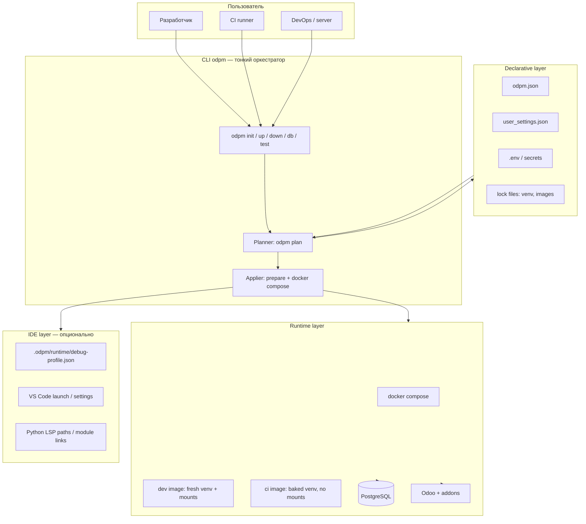
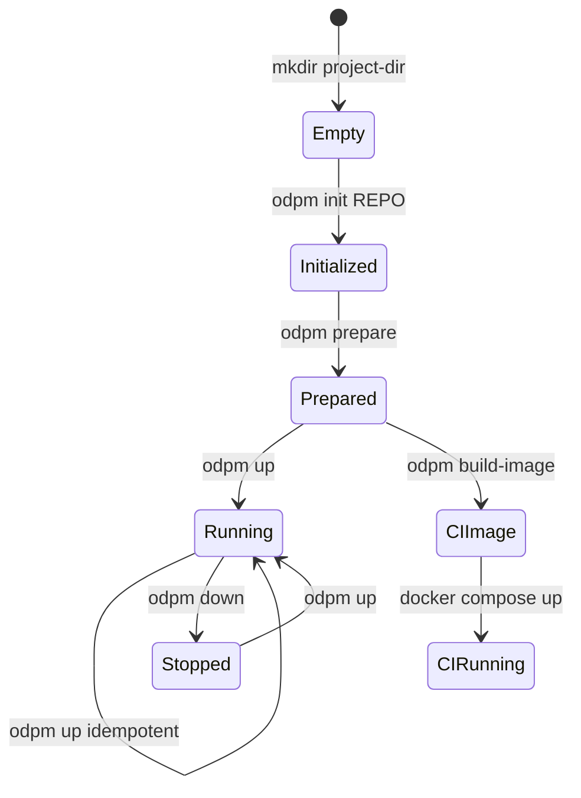
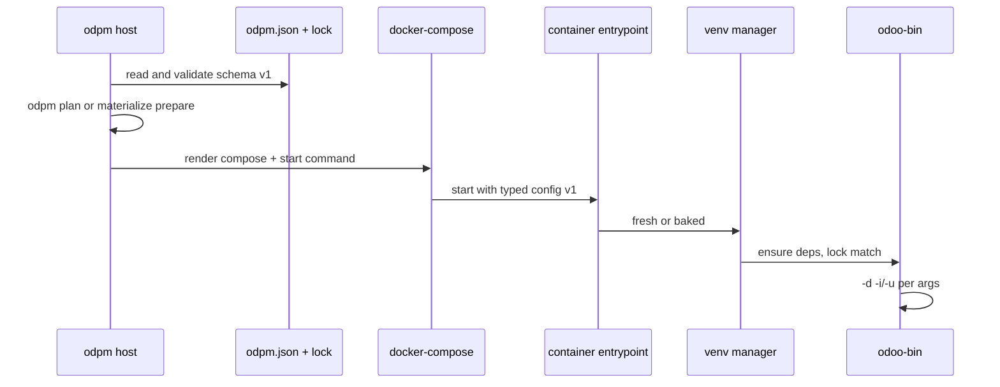
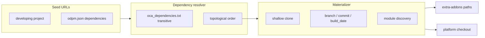
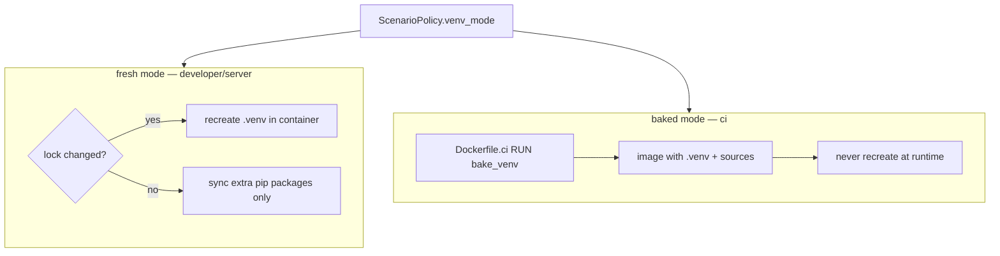
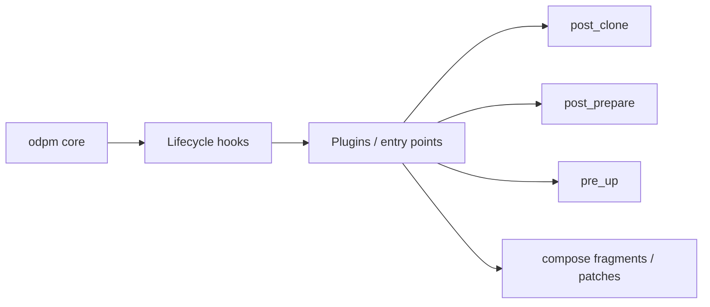
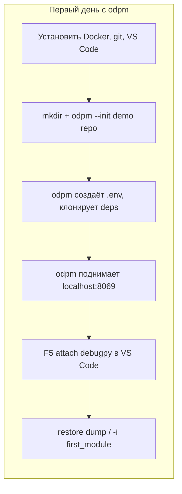

# Идеальная картина odpm: к чему ведут зрелые аналоги

Внутренний **vision / компас** для контрибьюторов (не пользовательская документация). Пользовательская карта альтернатив и матрица функционала — в [docs/getting-started/why-odpm.md](docs/getting-started/why-odpm.md). Актуальные планы фич — в `.cursor/plans/`.

odpm решает задачу **«reproducible Odoo dev environment from repo metadata»** — это не уникальная ниша, а хорошо изученный класс продуктов. Ниже — как это выглядит на **хорошем уровне**, с опорой на референсы и на то, куда проект уже пришёл к **4.7** / куда смотрит **4.8**.

---

## North Star: одна фраза

> **Клонировал репозиторий → одна команда → работающий Odoo с нужными аддонами, БД и отладчиком — на любой машине и в CI.**

`odpm.json` — **declarative manifest** окружения (как `package.json` для Node или `pyproject.toml` для Python, но для Odoo-стека).

---

## Референсы: кто уже «так делает»


| Инструмент                                                    | Уровень             | Что делает хорошо                                                                                            | Чем отличается от odpm                                                                |
| ------------------------------------------------------------- | ------------------- | ------------------------------------------------------------------------------------------------------------ | ------------------------------------------------------------------------------------- |
| **[Doodba](https://github.com/Tecnativa/doodba)** (Tecnativa) | Зрелый OSS          | Multi-stage Docker, aggregating repos, prod-like CI, onbuild hooks, `devel.yaml` / `test.yaml` / `prod.yaml` | Меньше «одной кнопки для новичка», больше DevOps-культуры; другая модель (`custom/`)  |
| **Official Odoo Docker**                                      | Минимальный         | Простой `docker run odoo:…`                                                                                  | Нет multi-repo, нет developing project, нет venv/debug                                |
| **[Dev Containers](https://containers.dev/)** (VS Code)       | Стандарт IDE        | `.devcontainer/` → reproducible workspace в Docker                                                           | Универсальный, не Odoo-specific (нет odpm.json, git deps, lock, scenarios)            |
| **Odoo.sh**                                                   | SaaS PaaS           | Git push → build → staging/prod, branches, backups                                                           | Закрытый, облачный; эталон UX для Odoo-команд                                         |
| **Gitpod / Codespaces**                                       | Cloud IDE           | URL → dev environment за минуты                                                                              | Облако, не self-hosted Docker на ноутбуке                                             |
| **Nix / devenv**                                              | Reproducibility max | Byte-identical deps                                                                                          | Крутая модель, но высокий порог входа                                                 |


**Вывод:** odpm ближе всего к **Doodba + Dev Container + Odoo.sh-lite для локалки**. Идеал — взять лучшее из каждого слоя, не копируя монолит. Подробная матрица «что уже закрыто в 4.7» — в why-odpm.

---

## Идеальная архитектура: слои


```mermaid
flowchart TB
    subgraph user [Пользователь]
        dev[Разработчик]
        ci[CI runner]
        ops[DevOps / server]
    end

    subgraph cli [CLI odpm — тонкий оркестратор]
        cmd[odpm init / up / down / db / test]
        plan[Planner: odpm plan]
        apply[Applier: prepare + docker compose]
    end

    subgraph manifest [Declarative layer]
        odpm_json[odpm.json]
        user_json[user_settings.json]
        env[.env / secrets]
        lock[lock files: venv, images]
    end

    subgraph runtime [Runtime layer]
        compose[docker compose]
        img_dev[dev image: fresh venv + mounts]
        img_ci[ci image: baked venv, no mounts]
        pg[(PostgreSQL)]
        odoo[Odoo + addons]
    end

    subgraph ide [IDE layer — опционально]
        profile[.odpm/runtime/debug-profile.json]
        vscode[VS Code launch / settings]
        lsp[Python LSP paths / module links]
    end

    dev --> cmd
    ci --> cmd
    ops --> cmd
    cmd --> plan
    plan --> manifest
    plan --> apply
    apply --> runtime
    apply --> ide
    manifest --> plan
    runtime --> odoo
    runtime --> pg
```


**Принцип:** CLI не «делает всё сам», а **читает manifest → при `odpm plan` показывает шаги → иначе материализует prepare и поднимает stack**. Как Terraform для dev-окружения, только локально и быстро.

---

## Идеальный lifecycle: три persona, один engine


```mermaid
stateDiagram-v2
    [*] --> Empty: mkdir project-dir
    Empty --> Initialized: odpm init REPO
    Initialized --> Prepared: odpm prepare
    Prepared --> Running: odpm up
    Running --> Running: odpm up idempotent
    Running --> Stopped: odpm down
    Stopped --> Running: odpm up
    Prepared --> CIImage: odpm build-image
    CIImage --> CIRunning: docker compose up
```


### Developer (`ODPM_SCENARIO=developer`)

- Bind-mount исходников, **fresh venv** при смене lock
- **debugpy** из коробки, VS Code / PyCharm attach
- **`dev_mode`** → Odoo `--dev` в compose; при `reload`/`all` auto-`inotify` в venv
- Postgres по политике security profile (по умолчанию convenience)
- Быстрый цикл: правка модуля → `-u my_module` без пересборки образа

### Server (`ODPM_SCENARIO=server`)

- Тот же stack, но **без debugpy**, published ports на `127.0.0.1`
- **`dev_mode` игнорируется** (warning в лог), как и `debugpy`
- Профиль **hardened** по умолчанию; nginx/TLS/backup — на операторе ([security](docs/operations/security.md))

### CI (`ODPM_SCENARIO=ci`)

- **Baked venv + sources в образе**, без bind-mount Odoo
- **`dev_mode` игнорируется** (как на server)
- `odpm --build-image` (docker / **kaniko**), prepare-only policy
- Тесты: `-i -u -t --stop-after-init` (цель 4.8 — `odpm test` + coverage)

**Идеал:** один `ScenarioPolicy` + **один runtime engine**, разные **profiles** — как Docker Compose profiles или Doodba's `devel`/`test`/`prod`. Scenario overlays в manifest v2 (`scenarios.*`) уже есть с **4.7**.

---

## Идеальный data flow: host → container

odpm передаёт config как **`.odpm/runtime/config.json`** (mount в контейнер, `ODPM_CONFIG_PATH`; в CI — baked в образ).


```mermaid
sequenceDiagram
    participant Host as odpm host
    participant Manifest as odpm.json + lock
    participant Compose as docker-compose
    participant Entry as container entrypoint
    participant Venv as venv manager
    participant Odoo as odoo-bin

    Host->>Manifest: read and validate schema v1
    Host->>Host: odpm plan or materialize prepare
    Host->>Compose: render compose + start command
    Compose->>Entry: start with typed config v1
    Entry->>Venv: fresh or baked
    Venv->>Odoo: ensure deps, lock match
    Odoo->>Odoo: -d -i/-u per args
```


**Контракт host↔container (достигнуто к 4.x):**

| Было (до 4.0)                              | Сейчас                                                                 |
| ------------------------------------------ | ---------------------------------------------------------------------- |
| ~~base64 JSON без `schema_version`~~       | Versioned schema + migration — `ContainerConfig` v1 + legacy v0        |
| ~~`bash -c 'cd && ... && odoo-bin ...'`~~  | Structured entrypoint (argv list) — `run_odoo` + exec form в compose   |
| ~~dict в container checkers~~              | Typed `ContainerConfig` dataclass                                      |
| ~~Host user vs container `odoo` mismatch~~ | Явные `HOST_USER` / `CONTAINER_USER`                                   |

Референс: Doodba кладёт конфиг в **файлы внутри образа** (`auto/` addons, `conf.d/`), а не в одну гигантскую shell-строку.

---

## Идеальный `odpm.json`: single source of truth

Концептуально (реальный формат — JSON; ниже упрощённый sketch nested **manifest v2**):

```json
{
  "manifest_schema": 2,
  "requires_odpm": "4.7.0",
  "odoo_version": "20.0",
  "python_version": "3.14",
  "distro_name": "debian",
  "distro_version": "13",
  "postgres_version": "18",
  "platform": {
    "git": "https://github.com/odoo/odoo.git 20.0"
  },
  "dependencies": [
    "git@github.com:OCA/web.git 20.0"
  ],
  "requirements_txt": ["python-ldap==3.4"],
  "service_sources": {},
  "services": {},
  "hooks": {},
  "scenarios": {
    "ci": { "odoo_conf": { "options": {} } }
  }
}
```

Плюс в git: `.odpm/deps.lock.json`. Локально: `user_settings.json`, `.env`, `.odpm/secrets.json`.

**Идеальное поведение:**

1. `odpm --init` — клонирует developing project, читает `odpm.json`
2. Всё остальное **детерминировано** из manifest + lock (+ scenario overlay)
3. `user_settings.json` — **локальные предпочтения** (модули `-i/-u`, demo data, sidecar gates), не дублирует platform deps
4. `.env` — scenario, порты, path roots; секреты — через provider / `${@secret:}`, не в git

Референс UX: **Odoo.sh** — push в git → система сама знает версию и зависимости из репозитория. Справочник полей: [odpm.json](docs/reference/odpm-json.md).

---

## Идеальная модель Git / dependencies


```mermaid
flowchart LR
    subgraph seeds [Seed URLs]
        dev_proj[developing project]
        odpm_deps[odpm.json dependencies]
    end

    subgraph resolver [Dependency resolver]
        oca[oca_dependencies.txt transitive]
        topo[topological order]
    end

    subgraph materializer [Materializer]
        clone[shallow clone]
        checkout[branch / commit / build_date]
        scan[module discovery]
    end

    seeds --> resolver
    resolver --> topo
    topo --> materializer
    materializer --> addons[extra-addons paths]
    materializer --> odoo_core[platform checkout]
```


**На хорошем уровне (в основном уже так):**

- **Один resolver** для init и для prepare (`DevelopingRepoMaterializer` + `dependency_resolver`)
- **Shallow clone** по умолчанию, deepen только для `build_date`
- **Dry-run:** `odpm plan` — шаги prepare/runtime, probe compose, `--plan-show-diff`, `--plan-strict`
- **Lock file** — `.odpm/deps.lock.json` (platform, dependencies, `service_sources`), `--update-lock`, CI verify
- Sidecar git-контексты — `service_sources` + проектные ссылки `service-sources/` (4.7)

Doodba делает это через **Git aggregator** и pinned commits в repos.yaml.

---

## Идеальный venv / images


```mermaid
flowchart TB
    policy[ScenarioPolicy.venv_mode]

    subgraph fresh [fresh mode — developer/server]
        lock_change{lock changed?}
        recreate[recreate .venv in container]
        sync[sync extra pip packages only]
        lock_change -->|yes| recreate
        lock_change -->|no| sync
    end

    subgraph baked [baked mode — ci]
        dockerfile[Dockerfile.ci RUN bake_venv]
        image[image with .venv + sources]
        no_recreate[never recreate at runtime]
        dockerfile --> image --> no_recreate
    end

    policy --> fresh
    policy --> baked
```


**Идеал:**

- **Один** `bake_venv` / `install_fresh`
- Lock hash = f(python, distro, odoo_version, requirements, venv_mode, arch)
- CI image **immutable**; dev — **mutable venv** с быстрым incremental sync
- **uv** в Debian 12/13 образах; `bake_venv.detect_uv()` / fallback на pip
- **Горизонт 4.8:** shared wheel cache (`ODPM_WHEEL_CACHE_ROOT`) для fleet workers

---

## Идеальный CLI: команды, а не флаги

Entry point `odpm` (pip) или legacy `odpm.py`. Часть глаголов уже есть (`plan`, `database`, `modules`, `run`, `scaffold`, `manifest`); остальное — смесь подкоманд и флагов.

```bash
odpm init https://github.com/acme/demo.git
odpm up                    # prepare if needed + compose up   # ещё идеал
odpm up --skip-start       # только regenerate templates      # близко: --skip-start
odpm down                                                     # ещё идеал
odpm database … / odpm -d … --db-restore …
odpm modules diff | record-applied
odpm run apply-modules-from-diff -d prod_db
odpm --build-image         # ci
odpm shell                 # ещё идеал
odpm logs -f odoo          # ещё идеал
odpm plan
odpm test …                # горизонт 4.8
```

**Уже есть:** `odpm plan`, `database`, `modules`, `run`, CSV для `-i`/`-u`, recipes.

**Горизонт 4.8:** `up`/`down`/`logs`/`shell` как first-class; `odpm test` + coverage; `--events-jsonl` для машинного стрима.

**Установка:** `pip install`, `.deb` / `.rpm`, APT/YUM suite `stable`. Host зависит от **stdlib + jsonschema + pluggy** (не «zero deps» — осознанный trade-off с 4.4).

Референсы: **docker compose**, **kubectl**, **doodba-qa** subcommands.

---

## Extensibility (есть с 4.4+)


```mermaid
flowchart LR
    core[odpm core]
    hooks[Lifecycle hooks]
    plugins[Plugins / entry points]

    core --> hooks
    hooks --> plugins

    plugins --> post_clone[post_clone]
    plugins --> post_prepare[post_prepare]
    plugins --> pre_up[pre_up]
    plugins --> compose[compose fragments / patches]
```


**Достигнуто:**

- Manifest v2: `hooks.post_clone` / `post_prepare` / `pre_up`, `services`, `service_patches`
- Pluggy: `odpm.prepare_steps`, `odpm.hooks`, `odpm.secrets_providers`
- Project-local: `.odpm/plugins/*.py`
- API **1.1** + [ADR-004](docs/contributing/adr-004-plugin-api-stability.md)
- Docs: [plugins.md](docs/reference/plugins.md)

**Не цель:** полный клон Doodba `custom/` surface (см. why-odpm).

**Горизонт:** Events JSONL для внешних потребителей; plugin `on_event` — follow-up после Events v1.

---

## Идеальное качество инструмента (vision)

Слои проверки: unit (policy, resolver, manifest), subprocess venv, compose-smoke на PR, opt-in / nightly golden path `init → HTTP 200`, контракт `ContainerConfig`.

**Сейчас:** обязательные PR gates — `compose-smoke` и `compose-smoke-mailpit`; full golden-path — opt-in (см. [ci.md](docs/contributing/ci.md)). Публичный demo / golden-path baseline — **Odoo 19.0**; код поддерживает **20.0**.

**Горизонт:** расширить demo/golden на 20.0; `odpm test` + coverage gate в CI-сценариях команд.

---

## Идеальный UX для новичка


```mermaid
flowchart LR
    subgraph day1 [Первый день с odpm]
        direction TB
        s1[Установить Docker, git, VS Code]
        s2[mkdir + odpm --init demo repo]
        s3[odpm создаёт .env, клонирует deps]
        s4[odpm поднимает localhost:8069]
        s5[F5 attach debugpy в VS Code]
        s6[restore dump / -i first_module]
        s1 --> s2 --> s3 --> s4 --> s5 --> s6
    end
```


**Идеал:** zero questions при наличии `odpm.json` (non-interactive — есть). TTY — wizard при первом запуске без `.env` (в т.ч. scenario-driven, ADR-018). Вход для новичков: [beginner-friendly](docs/getting-started/beginner-friendly.md).

---

## Где odpm 4.7 / 4.8 на этой карте

**Оси:** automation × качество architecture.


|                        | Ad-hoc architecture | Clean architecture                           |
| ---------------------- | ------------------- | -------------------------------------------- |
| **Высокая automation** | odpm 3.x            | **Doodba**, **Odoo.sh**, **odpm 4.7**        |
| **Низкая automation**  | —                   | Official Odoo Docker, Dev Containers         |


```
                        ad-hoc                 clean
              ┌────────────────────┬──────────────────────────────┐
  высокая     │                    │  Doodba                      │
  automation  │     odpm 3.x       │  Odoo.sh                     │
              │                    │  odpm 4.7  ◄── здесь сейчас  │
              │                    │  4.8 → automation surface    │
              ├────────────────────┼──────────────────────────────┤
  низкая      │                    │  Official Odoo Docker        │
  automation  │         —          │  Dev Containers              │
              └────────────────────┴──────────────────────────────┘
```

**Достигнуто к 4.7 (сжато):** clean pipeline/policy; `odpm plan`; `deps.lock`; manifest v2 + plugins/hooks; scenario overlays; compose prefix/network; layered `.env`; secrets + Infisical; `service_sources`; recipes / modules diff; security profiles; Odoo 20 defaults; CI docker/kaniko.

Архитектурный чеклист рефакторинга 4.0 (facade Config, typed snapshot, DI, no global CWD, …) — **считаем закрытым**; детали живут в коде и ADR.

### Открытый backlog (компас на 4.8+)

1. **Events JSONL** (`--events-jsonl`) — machine-readable ход prepare/runtime для CI / odpm.web
2. **Shared wheel cache** — `ODPM_WHEEL_CACHE_ROOT` для N проектов на одном worker
3. **`odpm test` + coverage** — subcommand, отчёты, `--coverage-fail-under`
4. **Appliance edges** — Traefik ingress labels + native DB backup zip (контракт odpm.web)
5. **CLI verbs** — `up` / `down` / `logs` / `shell` как first-class
6. **Мелкие follow-up 4.7** — не materialize `service_sources` для выключенных sidecars; HostGateInputs / явный SystemCheckPolicy; опционально Vault/SOPS provider
7. **Demo / golden на Odoo 20.0** — публичный путь сейчас на 19.0

Сознательно **не** целимся: PaaS как Odoo.sh; полный prod nginx/TLS; клон всего Doodba `custom/`; Nix byte-identical.

---

## Практический «идеал» в одном абзаце

**odpm** — **declarative Odoo environment manager**: `odpm.json` описывает platform, deps, sidecars и scenarios; CLI показывает `plan` и материализует Docker stack; container entrypoint — typed `ContainerConfig`; venv fresh (dev/server) или baked (CI); IDE и DB/module tools — thin wrappers; extensibility — hooks и plugins; дальше — automation surface (events, test/coverage, wheel cache, appliance) без потери «одной кнопки» для новичка.

Инструмент не «изобретает велосипед» — он **собирает Odoo-specific Dev Container** между «голым docker odoo» и «тяжёлым Doodba». Пользовательское обоснование ниши — [why-odpm](docs/getting-started/why-odpm.md).
